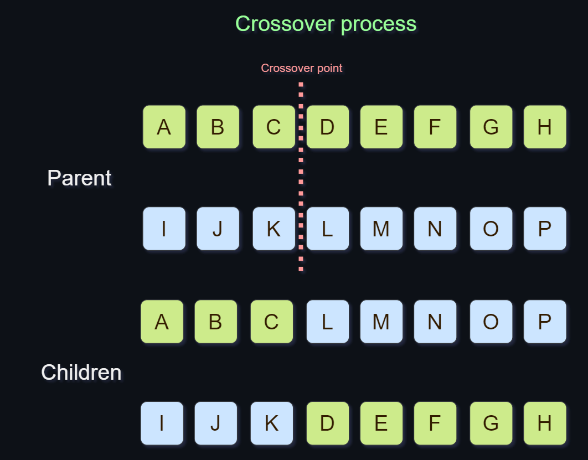

# 🧬 Genetic Algorithm Implementation in Java
## Under development... 🚀

## 📝 Table of Contents
- [Overview](#-overview)
- [Genetic Algorithm Idea](#-genetic-algorithm-idea)
- [Genetic Algorithm Implementation](#-genetic-algorithm-implementation)

## 📖 Overview
This project is a Java implementation of a Genetic Algorithm, a stochastic optimization algorithm inspired by natural selection and genetics. 

## 🧬 Genetic Algorithm Idea
The idea behind the Genetic Algorithm is to find the best solution to a problem by mimicking the process of natural selection and genetics. The algorithm starts with a population of individuals, each one representing a possible solution to the problem. Each individual is evaluated and assigned a fitness score, which represents how good the solution is. The individuals with the best fitness scores are selected to reproduce, and the offspring of the reproduction process will be the new population. The process is repeated until a solution is found or a maximum number of generations is reached.


### Calculating the Fitness Score
In our case an individual is a string of characters, and the problem is to find a string that matches a given target string. The fitness score of an individual is calculated by counting the number of characters that didn't match the target string. The lower the fitness score, the better the solution. For example, if the target string is `Hello World!` and the individual is `Hello World?`, the fitness score will be 1, because the `?` character doesn't match the `!` character.

- The corresponding Java code is:
```java
public class Individual {
    // Chromosome
    private List<Character> genes = new ArrayList<>();
    // Fitness score
    private double fitness;

    public void calculateFitness(String target) {
        // Initialize fitness to chromosome length
        fitness = genes.size();

        for(int i = 0; i < genes.size(); i++)
            if(genes.get(i).equals(target.charAt(i)))
                fitness -= 1;
    }
}
```

### Selection
The selection is the process of choosing the individuals that will reproduce. The individuals with the best fitness scores have a higher chance of being selected, but the individuals with the worst fitness scores also have a chance of being selected. This is done to avoid the algorithm getting stuck in a local minimum.

In our case, the size of the population is fixed, so the selection process consists of sorting the individuals by their fitness scores and keeping the fittest individuals. The fittest individuals will be the parents of the next generation.
- The corresponding Java code is:
```java
public class Population {
    private final int populationInitSize;
    private List<Individual> individuals = new ArrayList<>();
    private Individual firstFittest;
    private Individual secondFittest;
    
    public void selection(){
        Collections.sort(individuals);
        
        // Keep populationSize fittest individuals
        individuals = individuals.subList(0, populationInitSize);
        
        firstFittest = individuals.get(0);
        secondFittest = individuals.get(1);
    }
}
```

### Crossover
The crossover is the process of creating the offspring of the reproduction process. The offspring will inherit some of the characteristics of their parents. In our case, the offspring will inherit some of the characters of their parents. The crossover is done by choosing a random crossover point and swapping the characters of the parents after that point. For example, if the parents are `Hello World!` and `Hello World?`, and the crossover point is 6, the offspring will be `Hello World?` and `Hello World!`.



## 🧬 Genetic Algorithm Implementation